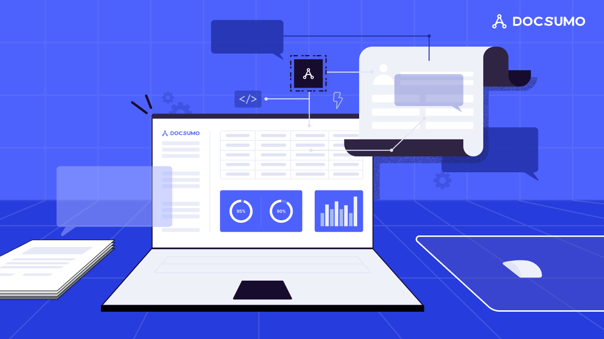

# URL Text Extraction and Analysis



## Overview

This project extracts text from a list of URLs and performs a detailed textual analysis to compute various linguistic and sentiment metrics. The extracted data is saved to text files, and the analysis results are compiled into an Excel file.

 


 

## Folder Structure:

```
url-text-extraction-analysis/
├── extracted_texts/         # Directory to store extracted article texts
├── Input.xlsx               # Input file with URLs
├── Output Data Structure.xlsx # Output file with analysis results
├── Article_extrction.py   # Main script for extraction and analysis
├── requirements.txt         # List of required Python libraries
└── README.md                # This README file

```

## Features

- **Text Extraction**: Extracts article text from a list of provided URLs.
- **Text Analysis**: Computes various metrics such as sentiment scores, readability indices, and word counts.
- **Excel Output**: Saves the analysis results to an Excel file for easy interpretation.

## Installation

1. **Clone the repository**:
   ```bash
   git clone https://github.com/Blacksujit/Data-Extraction-and-NLP.git
```

2. run script 

    ``` Article_extrction.py 
```

## Install the required Python libraries:


```
pip install -r requirements.txt

```

## Download the necessary NLTK data:


```

import nltk
nltk.download('punkt')
nltk.download('cmudict')

```

## Results:

### The analysis results are saved in Output Data Structure.xlsx, containing the following metrics for each URL:

1.) Positive Score

2.) Negative Score

3.) Polarity Score

4.) Subjectivity Score

5.) Average Sentence Length

6.) Percentage of Complex Words

7.) Fog Index

8.) Average Words per Sentence

9.) Complex Word Count

10.) Word Count

11.) Syllables per Word

12.) Personal Pronouns Count

13.) Average Word Length


## Contributing:


Feel free to contribute to this project by submitting a pull request or opening an issue.

## License:


This project is licensed under the MIT License
